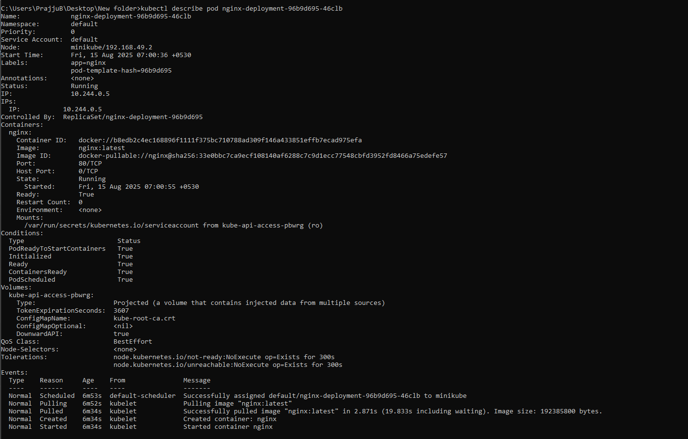

## 🚀 Kubernetes Cluster Locally with Minikube

### 🎯Objective

Set up a local Kubernetes cluster using **Minikube**, deploy an application, expose it via a Kubernetes Service, scale deployments, inspect logs, and verify using ```kubectl```

### 🛠️ Tools & Technologies

* Minikube – Local Kubernetes cluster
* kubectl – Kubernetes CLI tool
* Docker – Containerization 
* Nginx – Sample application

## Prerequisites
- `deployment.yaml` – Deployment configuration for the app  
- `service.yaml` – Service configuration to expose the app  

### Install Required Tools
- **Minikube** - [Download](https://github.com/kubernetes/minikube/releases/latest) and place `minikube.exe` in your PATH. e.g, C:\Windows\System32
- **kubectl** - [Install Guide](https://kubernetes.io/docs/tasks/tools/install-kubectl-windows/) Add its folder to your PATH environment variable for cmd/powershell usage.
- **Docker Desktop** - [Download](https://www.docker.com/products/docker-desktop) Start Docker Desktop and ensure it's running.
- **Text Editor** - (VSCode, Notepad++, etc.)

**Tip:** In Docker Desktop, enable "Use the WSL 2 based engine" for better performance.

## 🛠️ Steps to Set Up and Deploy

**1. Start Minikube Cluster** 

Open PowerShell or CMD as administrator, then run:
```
minikube start --driver=docker
```


This starts a local Kubernetes cluster using Docker as the VM driver.

Verify cluster:

```
minikube status
kubectl cluster-info
```


**2. Create Deployment YAML ( deployment.yaml )**

Using any text editor ( Notepad, VSCode ), create a file named deployment.yaml with this content (example with nginx):
```
apiVersion: apps/v1
kind: Deployment
metadata:
  name: nginx-deployment
spec:
  replicas: 2
  selector:
    matchLabels:
      app: nginx
  template:
    metadata:
      labels:
        app: nginx
    spec:
      containers:
      - name: nginx
        image: nginx:latest
        ports:
        - containerPort: 80
```
Save the file in a folder accessible by PowerShell or CMD.

**3. Deploy the App**

Run:
```
kubectl apply -f path\to\deployment.yaml
```


Verify pods:
```
kubectl get pods
```


**4. Create Service YAML ( service.yaml )**

Create a file named service.yaml with this content:
```
apiVersion: v1
kind: Service
metadata:
  name: nginx-service
spec:
  selector:
    app: nginx
  ports:
  - protocol: TCP
    port: 80
    targetPort: 80
    nodePort: 30001
  type: NodePort
```
Save it.

**5. Expose Deployment Using Service YAML**

Apply service file.
```
kubectl apply -f path\to\service.yaml
```

Check services:
```
kubectl get svc
```

Access the nginx app from your browser:
```
minikube ip
```


Open http://<minikube-ip>:30001 in your browser.

**6. Scale the Deployment**

Scale replicas, e.g, to 4 pods:
```
kubectl scale deployment/nginx-deployment --replicas=4
```

Verify pod count:
```
kubectl get pods
```

**7. Inspect Pod Details and Logs**

Describe a specific pod:
```
kubectl describe pod <pod-name>
```

Get logs of a pod:
```
kubectl logs <pod-name>
```

#### This flow covers your objectives: installing Minikube, deploying an app with deployment.yaml, exposing it using service.yaml, verifying pods, scaling deployments, and viewing logs using kubectl commands

